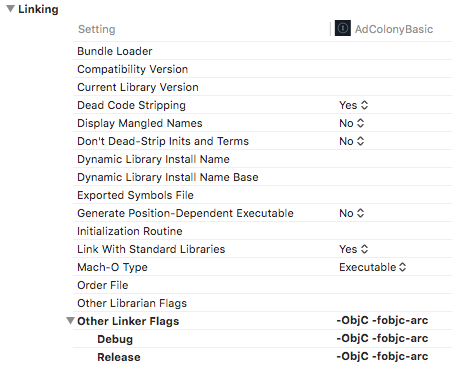

### AdColony SDK取得URL ###

<table>
<tr>
<td>AdColony-iOS-SDK</td>
<td><a href="https://github.com/AdColony/AdColony-iOS-SDK-3">https://github.com/AdColony/AdColony-iOS-SDK-3</a></td>
</tr>
</table>

### Notes ###

- iOS 10で動作保証されています。
- ATS仕様に準拠しています。
- iOS 6.0以上に対応しています（動画広告はiOS 7.0以上のみ対応）。
- 主要なAPIの変更により、バージョン2.XのSDKと後方互換性はありません。

### iOS 10 ###

iOS10にて追加された新しい仕様の中に、本SDKの実装に影響を及ぼすものが存在します。  
詳細は[Xcode Project Setup](#xcode-project-setup)を参照してください。

----

### Contents ###

* [Xcode Project Setup](#xcode-project-setup)
* [インタースティシャル広告](#インタースティシャル広告)
* [動画リワード広告](#動画リワード広告)
* [APIリファレンス](#apiリファレンス)
* [よくある質問](#よくある質問)
    * [基本情報に関して](#基本情報に関して)
    * [SDK仕様に関して](#sdk仕様に関して)
    * [動画再生に関して](#動画再生に関して)
    * [ストア申請に関して](#ストア申請に関して)


## Xcode Project Setup ##

### iOS 10 ###

iOS 10に関連する導入手順の変更点は[こちら](#7-プライバシーコントロールの設定を追加)をご覧下さい。

### CocoaPodsを使うインストール方法 ###

[CocoaPods](https://cocoapods.org)は、AdColonyを導入するもっとも簡単な方法です。  
下記をPodfileに設定することで最新のAdColonyをXcodeプロジェクトに導入することができます。

```bash
pod 'AdColony'
```

SDKのバージョンを指定してインストールする必要がある場合、[CocoaPod repository](https://github.com/CocoaPods/Specs/tree/master/Specs/AdColony)に存在するバージョンであれば、下記のような指定で導入することもできます。

```bash
pod 'AdColony', '~> 3.1.0'
```

続いて[こちら](#4-サポートする端末の向きを設定)からセットアップを行ってください。
 
### CocoaPodsを使わないインストール方法 ###

1. FrameworkをXcodeプロジェクトに追加
2. 必須の依存ライブラリをリンク
3. リンカーフラグを追加
4. サポートする端末の向きを設定
5. App Transport Security (ATS) の設定を追加
6. AdColonyが利用するURLスキームの設定を追加
7. プライバシーコントロールの設定を追加

#### 1. FrameworkをXcodeプロジェクトに追加 ####

`AdColony.framework`をプロジェクトにコピー(ドラッグ)してください。また、AdColonyを利用する全てのターゲットにチェックを入れてください。

**Target > Build Settings > Architectures** を開いて、ベースSDKは9.0以降に設定してください。アーキテクチャは`armv6`を設定していないことを確認してください。


#### 2. 必須の依存ライブラリをリンク ####

**Target > Build Phases > Link Binary With Libraries** を開いて、下記のライブラリとフレームワークを追加してください。

* `libz.1.2.5.tbd`
* `AdColony.framework`
* `AdSupport.framework`
* `AudioToolbox.framework`
* `AVFoundation.framework`
* `CoreTelephony.framework`
* `EventKit.framework`
* `JavaScriptCore.framework` (Set to Optional)
* `MessageUI.framework`
* `Social.framework`
* `StoreKit.framework`
* `SystemConfiguration.framework`
* `WatchConnectivity.framework` (Set to Optional)
* `WebKit.framework` (Set to Optional)


#### 3. リンカーフラグを追加 ####

AdColony SDK はクラスローディングの機能を利用します。したがって以下のリンカーフラグを **Target > Build Settings > Linking > Other Linker Flags** に追加する必要があります。

- `-ObjC`
- `-fobjc-arc`



#### 4. サポートする端末の向きを設定 ####

AdColony SDKはあなたのアプリが全ての端末の向きをサポートすることを要求します。これはAdColonyの広告があらゆる向きで表示される可能性があり、AdColonyのview controllerがあなたのアプリに同じ挙動を要求するからです。この要求は、あなたのアプリのインターフェースが全ての向きに対応するように指示しているわけではないことに注意してください。ただあなたのview controllerの`supportedInterfaceOrientations`メソッドで共通設定をオーバーライドする必要があるだけです。

この要求を満たす最も簡単な方法は、Xcodeの **General** タブにあるDevice Orientation全てにチェックを入れることです。


もしくは **AppDelegate** クラスの`application:supportedInterfaceOrientationsForWindow:`メソッドを下記のようにオーバライドすることでも実現できます。

```objc
#import <AdColony/AdColony.h>

@implementation AppDelegate
/* Class body ... */

-(UIInterfaceOrientationMask)application:(UIApplication *)application supportedInterfaceOrientationsForWindow:(UIWindow *)window {
    return UIInterfaceOrientationMaskAll;
}
```

#### 5. App Transport Security (ATS) の無効化 ####

iOS 9のリリースと共にAppleはATSを導入しました。ATSはアプリにSSLによるセキュアなネットワーク接続をするよう要求するものであり、SSLのバージョン、暗号化方式、およびキーの長さについてATSの仕様に則ってHTTPS接続を強制します。iOSではATSがデフォルトで有効になっていますが、現在のところAppleによって要求されたり強制されたりはしていません。

したがって、広告在庫を最大化したり可能な限り高いeCPMを受け取るために、次の2つの方法のいずれかを正しく設定することが重要です。

##### 方法1: ATSを無効化して利用する

開発者はInfo.plistファイルに下記の項目を追加することでATSを無効化することができます。

```xml
<key>NSAppTransportSecurity</key>
<dict>
    <key>NSAllowsArbitraryLoads</key>
    <true/>
</dict>
```

##### 方法2: ATSは有効のまま利用する

iOS 10では、`NSAllowsArbitraryLoadsInWebContent`と`NSAllowsLocalNetworking`が存在すると、`NSAllowsArbitraryLoads`の値がNOに上書きされる仕様になっています。これにより、iOS 10でATSを無効にすることなく、古いオペレーティングシステムでアプリケーションの必要に応じて`NSAllowsArbitraryLoads`をYESに設定できます。

iOS 10でATSを有効のまま利用したい開発者は、下記の項目をInfo.plistファイルに追加する必要があります。

```xml
<key>NSAppTransportSecurity</key> 
<dict>
    <key>NSAllowsArbitraryLoads</key> 
    <true/> 
    <key>NSAllowsLocalNetworking</key> 
    <true/> 
    <key>NSAllowsArbitraryLoadsInWebContent</key> 
    <true/>
</dict>
```

ただし、`NSAllowsArbitraryLoadsInWebContent`をYESで追加することにより、アプリの審査の過程で「正当な理由」をAppleから求められることになります。その際は正当な理由として次の内容を説明する事をお勧めます。

> Must provide embedded web content from a variety of sources, but cannot use a class supported by the NSAllowsArbitraryLoadsInWebContent key.
> 
> 様々なウェブコンテンツを表示する必要があるが`NSAllowsArbitraryLoadsInWebContent`がiOS 9で利用できないため

#### 6. AdColonyが利用するURLスキームの設定を追加 ####

iOS 9のリリースと共にAppleは`canOpenURL:` APIの使用についても制限するようになりました。AdColonyはDynamic End Cards (DECs)からユーザが特定のアプリを開けるかどうかを判断するためにこのAPIを使用しています。例えば、新しい映画のための広告があり、そのDECがTwitterアプリを利用してユーザにその映画についてtweetできるような機能を提示することができます。このような機能はiOS 9ではまだ利用可能ですが、パブリッシャはAdColonyがリンクされてるアプリに対して、それぞれのURLスキームをplistファイルで認可しなければなりません。URLスキームが追加されてない場合、代わりにユーザはWEBサイトに連れて行かれてしまうことに注意してください。これは例えばサイトにログインしないといけないなどの望ましくないユーザエクスペリエンスを招く可能性があります。AdColony SDKがアプリへのdeep-linkingを可能にするために、以下の項目をアプリのplistに追加してください。

```xml
<key>LSApplicationQueriesSchemes</key>
<array>
    <string>fb</string>
    <string>instagram</string>
    <string>tumblr</string>
    <string>twitter</string>
</array>
```

#### 7. プライバシーコントロールの設定を追加 ####

iOS 10のリリースに伴い、Appleはカメラやフォトライブラリなどの機能へのアクセスを制限することによってプライバシー管理の範囲を拡張しました。これらの機能を活用してリッチで没入的な体験をユーザに届けるために、以下の項目をアプリのplistファイルに追加してください。

```xml
<key>NSCalendarsUsageDescription</key>
<string>Some ad content may create a calendar event.</string>
<key>NSPhotoLibraryUsageDescription</key>
<string>Some ad content may require access to the photo library.</string>
<key>NSCameraUsageDescription</key>
<string>Some ad content may access camera to take picture.</string>
<key>NSMotionUsageDescription </key>
<string>Some ad content may require access to accelerometer for interactive ad experience.</string>
```

アプリを Xcode 7（iOS 9 SDK）でコンパイルする場合は、これらの項目の追加は必要ありません。

## インタースティシャル広告 ##

AdColonyインタースティシャル広告は、動画広告の再生直後にエンドカードが続く形式の広告です。

### Instructions ###

[Xcode Project Setup](#xcode-project-setup)を終えたら下記の４ステップでインタースティシャル広告を表示することができます。

1. app ID、zone IDを作成（Glossomにて発行しお渡し致します。）
2. SDKの設定関数でご自身のapp ID, zone IDを設定
3. インタースティシャル広告をAdColonyにリクエスト
4. 広告を表示

### Code Example - Configuring AdColony ###

Glossomがお渡しするapp IDとzone IDを使ってAdColony SDKの環境設定を行ってください。

```objc
#import <AdColony/AdColony.h>

@implementation AppDelegate
/* Class body ... */

- (BOOL)application:(UIApplication *)application didFinishLaunchingWithOptions:(NSDictionary *)launchOptions {
    /* Method body ... */

    [AdColony configureWithAppID:/* App ID */ 
              zoneIDs:@[/* Zone IDs */] 
              options:nil
              completion:^(NSArray<AdColonyZone*>* zones) {}
    ];

    return YES;
}
```

### Code Example - Requesting an Interstitial ###

```objc
#import <AdColony/AdColony.h>

@implementation ViewController

/* Class body ... */
-(void)requestInterstitial {
    [AdColony requestInterstitialInZone:/* Zone ID */ options:nil
        success:^(AdColonyInterstitial* ad) {
            ad.open = ^{
                NSLog(@"Ad opened");
            };
            ad.close = ^{
                NSLog(@"Ad closed");
            };
            ad.expire = ^{
                // adの有効期限が切れたら再度リクエストする
                NSLog(@"Ad expired");
                [self requestInterstitial];
            };

            _ad = ad;
        }
        failure:^(AdColonyAdRequestError* error) {
            NSLog(@"Interstitial request failed with error: %@", [error localizedDescription]);
        }
     ];
}
```

### Code Example - Showing the Interstitial ###

インタースティシャル広告のリクエスト成功のコールバックで渡される`AdColonyInterstitial`オブジェクトを利用して、適切なタイミングでフルスクリーンの広告を表示してください。

```objc
#import <AdColony/AdColony.h>

@implementation ViewController

/* Class body ... */
-(void)showInterstitial {
    [_ad showWithPresentingViewController:self];
}
```

## 動画リワード広告 ##

AdColonyの動画リワード広告はインセンティブ（仮想通貨やユーザー体験）が付随しているかどうかという点において通常のインタースティシャル広告と異なります。ユーザがリワード広告を見たときにSDKはユーザに対してインセンティブを付与します。

### Instructions ###

[Xcode Project Setup](#xcode-project-setup)を終えたら下記の４ステップで動画リワード広告を表示することができます。

1. app ID、zone IDを作成（Glossomにて発行しお渡し致します。）
2. SDKの設定関数でご自身のapp ID, zone IDを設定し、zoneにリワードハンドラを設定
3. インタースティシャル広告をAdColonyにリクエスト
4. 広告を表示

### Code Example - Configuring the SDK with a Rewarded Zone ###

Glossomがお渡しするapp IDとzone IDを使ってAdColony SDKの環境設定を行ってください。  
さらにzoneのリワードハンドラも設定してください。

```objc
#import <AdColony/AdColony.h>

@implementation AppDelegate
/* Class body ... */

- (BOOL)application:(UIApplication *)application didFinishLaunchingWithOptions:(NSDictionary *)launchOptions {
    /* Method body ... */

    [AdColony configureWithAppID:/* App ID */ zoneIDs:@[/* Zone ID */] options:nil completion:^(NSArray<AdColonyZone*>* zones) {
        AdColonyZone* zone = [zones firstObject];

        /* 特定のzoneにリワードハンドラを設定 */
        zone.reward = ^(BOOL success, NSString* name, int amount) {
            NSLog(@"Reward with success: %@ name: %@ and amount: %d", success ? @"YES" : @"NO", name, amount);
            [self rewardUser];
        };
    }];

    return YES;
}
```

### Code Example - Requesting a Rewarded Interstitial ###

```objc
#import <AdColony/AdColony.h>

@implementation ViewController

/* Class body ... */
-(void)requestInterstitial {
    [AdColony requestInterstitialInZone:/* Zone ID */ options:nil
        success:^(AdColonyInterstitial* ad) {
            ad.open = ^{
                NSLog(@"Ad opened");
            };
            ad.close = ^{
                NSLog(@"Ad closed");
            };
            ad.expire = ^{
                // adの有効期限が切れたら再度リクエストする
                NSLog(@"Ad expired");
                [self requestInterstitial];
            };

            _ad = ad;
        }
        failure:^(AdColonyAdRequestError* error) {
            NSLog(@"Interstitial request failed with error: %@", [error localizedDescription]);
        }
     ];
}
```

### Code Example - Showing the Rewarded Interstitial ###

インタースティシャル広告のリクエスト成功のコールバックで渡される`AdColonyInterstitial`オブジェクトを利用して、適切なタイミングでフルスクリーンの広告を表示してください。

```objc
#import <AdColony/AdColony.h>

@implementation ViewController

/* Class body ... */
-(void)showInterstitial {
    [_ad showWithPresentingViewController:self];
}
```

----

### サーバサイド リワード ###

あなたの仮想通貨経済をセキュアにするためにAdColonyはコールバックを実行します。AdColonyは、仮想通貨を扱うサーバに直接セキュリティのためにハッシングメッセージを使用するコールバックを発行します。AdColonyのリワードインタースティシャル広告を用いてユーザにリワードを付与するために、あなたのゲームサーバ上にコールバックURLを作成してください。AdColonyはそのコールバックURLに対してURLパラメータを付与するので、そのパラメータを用いてあなたのシステム上でユーザの仮想通貨残高を更新します。

AdColonyではクライアントサイドだけで仮想通貨をハンドリングすることも可能です。しかしクライアントサイドでセキュアな仮想通貨システムを作ることはできないため、その方法の利用は推奨されていないことに注意してください。私たちはクライアントサイドのシステムを難解にするために最善を尽くしていますが、そのセキュリティを保証することはできません。あなたの仮想通貨システムを管理するためにサーバを使用することができない場合、使用上のガイドラインについては [video-ad@glossom.co.jp](video-ad@glossom.co.jp) にお問い合わせください。

#### Step 1 - Creating a callback URL ####

あなたのサーバ上にAdColonyのコールバックを受け取るURLを作成してください。コールバックURLは認証を要求しないようにしてください。URLを作成したら弊社の担当者にご連絡ください。弊社にてzoneのサーバサイドリワードを有効にし、ポストバック用のURLを設定致します。

#### Step 2 - Set custom ID ####

AdColony SDKにcustom\_idを設定してください。これは毎回コールバックするときにアプリのサーバサイドにも送信されます。custom_idを利用することで、リワードを付与するユーザを識別することができます。

```objc
AdColonyAppOptions *options = [AdColonyAppOptions new];
options.userID = @"/* custom_id */";
[AdColony configureWithAppID:/* App ID */
					 zoneIDs:@[/* Zone ID */]
					 options:options
					 completion:^(NSArray<AdColonyZone*>* zones) {}];
```

#### Step 3 - Handling the AdColony Callbacks ####

URLがAdColonyのコールバックに対して適切にレスポンスするようにしてください。AdColonyがコールするURLのフォーマットは下記です。`[]`が示す文字列は、あなたのアプリやトランザクジョンの内容によって異なります。

```
[http://www .yourserver.com/anypath/callback_url.php]?id=[ID]&uid=[USER_ID]&zone=[ZONE_ID]&amount=[CURRENCY_AMOUNT]&currency=[CURRENCY_TYPE]&verifier=[HASH]&open_udid=[OPEN_UDID]&udid=[UDID]&odin1=[ODIN1]&mac_sha1=[MAC_SHA1]
```

open\_udid、udid、odin1、mac\_sha1 についてはAndroidにおいて常に空になることに注意してください。もしあなたのアプリがAdColonyにユーザを識別するcustom_idを提供している場合は、コールバックURLの末尾に`&custom_id=[CUSTOM_ID]`も追加する必要があります。追加しない場合はcustom\_idがサーバ上で取得できなくなります。ハッシュ化やverifierに対してチェックする前にも、あなたのテスト文字列の末尾にcustom\_idを追加する必要があります。

コールバックURLにPHPを使うことは必須ではありません。MD5のハッシュチェックをサポートしていれば、どんなサーバサイドの言語でも利用することが可能です。

ご参考までに、下記のPHPとMySQLを用いたサンプルでURLパラメータへのアクセス、MD5ハッシュチェック、重複トランザクジョンのチェック、適切なレスポンス内容について説明します。

```php
<?php

    $MY_SECRET_KEY="Thiscomesfromadcolony.com";

    $trans_id=mysql_real_escape_string($_GET['id']); 
    $dev_id=mysql_real_escape_string($_GET['uid']); 
    $amt=mysql_real_escape_string($_GET['amount']); 
    $currency=mysql_real_escape_string($_GET['currency']); 
    $verifier=mysql_real_escape_string($_GET['verifier']);
    $custom_id = mysql_real_escape_string($_GET['custom_id']);

    //ハッシュ値の検証 
    $test_string="".$trans_id.$dev_id.$amt.$currency.$MY_SECRET_KEY.$custom_id; 
    $test_result=md5($test_string);
    if($test_result!=$verifier)
    {
      echo"vc_decline";
      die; 
    }

    //ユーザの不正検知 
    $user_id=//get your internal user id from the device id here 
    if(!$user_id)
    {
      echo"vc_decline";
      die; 
    }

    //トランザクションを保存 
    $query="INSERT INTO AdColony_Transactions(id,amount,name,user_id,time)".
      "VALUES($trans_id,$amt,'$currency',$user_id,UTC_TIMESTAMP())"; 
    $result=mysql_query($query);
    if(!$result)
    {
      //トランザクションが重複していた場合 
      if(mysql_errno()==1062)
      {
        echo"vc_success";
        die; 
      }
      //重複していないがレコード作成に失敗した場合。AdColonyがリトライできるように 
      else
      {
        echo"mysql error number".mysql_errno();
        die; 
      }
    }
    //ユーザにリワードを付与したのち"vc_success"をレスポンス
    echo"vc_success";
?>
```

上記のPHPのサンプルが参照するMySQLのテーブルは以下のコードを用いて作成可能です。

```sql
CREATE TABLE `AdColony_Transactions` (
`id` bigint(20) NOT NULL default '0',
`amount` int(11) default NULL,
`name` enum('Currency Name 1') default NULL, `user_id` int(11) default NULL,
`time` timestamp NULL default NULL,
PRIMARY KEY (`id`)
) ENGINE=MyISAM DEFAULT CHARSET=latin1;
```

重複したトランザクジョンを防止するために、受け取った全てのトランザクジョンのidに関してレコードを作成し、パラメータを検証したのちトランザクジョンのidをレコードに対してチェックしてください。もしトランザクションのidが重複している場合は、ユーザにリワードを付与する必要はありません。

重複のトランザクションをチェックした後で、指定された種類と量の仮想通貨をユーザに付与してください。

#### Step 4 - Configuring Your Server's Responses ####

あなたのサーバがトランザクションの結果に基づいた適切なレスポンスをするように保証してください。

- "vc_success"
  - 正常に処理が終了しユーザーへのリワード付与が成功した場合。AdColony側から再送信を行いません。
- "vc\_decline" or "vc\_noreward"
  - 正常に処理が終了したが、uidの誤り/不正と判断された場合。AdColony側から再送信を行いません。
- その他
  - AdColonyは定期的に再送信を行います。異常な場合以外はこちらの利用は控えて下さい。

**Note:** リワードを付与しなくても良いケースは、uidが不正な場合、セキュリティチェックに通過しない場合、トランザクションが重複していて既にリワードが付与されている場合、のみです。

## APIリファレンス ##

SDKのAPIリファレンスは[こちら](https://adcolony-www-common.s3.amazonaws.com/Appledoc/3.1.0/index.html)をご参照ください。

## よくある質問 ##

### 基本情報に関して ###

#### Q:各設定情報はどんな意味ですか

- **App ID**: こちらは各アプリを指します。
- **Zone ID**: こちらはアプリの下に紐づく、各掲載枠を指します。
- **Call Back URL**: 動画再生の成果等を送るURLになります。設定していただかなくても本サービスはご利用頂けます。
- **Custom ID**: CustomIDは、mediaのユーザーidを設定していただきます。設定した値はcall backを使用する場合、custom_idとして返します。

### SDK仕様に関して ###

#### Q: AdColonyダイアログでポップアップの国別表記は可能か？

アプリの配信国に沿った各々の表記を行う場合、アプリ内でダイアログのご実装をご自身でして頂く必要がございます。

#### Q: 上限回数は何回ですか？

上限回数は変更可能です。変更希望の場合、弊社担当者もしくは [video-ad@glossom.co.jp](mailto:video-ad@glossom.co.jp) までご連絡下さい。

#### Q: インセンティブはコイン以外でも可能か？

可能です。御社側で、動画視聴の成果通知に合わせてご実装して頂く必要がございます。

#### Q: custom_idの設定方法を教えてください。

custom_idはSDKの環境設定時に引数として渡す`AdColonyAppOptions`のオブジェクトで以下のように指定することで設定することが可能です。`AdColonyAppOptions`の詳細は[こちら](https://adcolony-www-common.s3.amazonaws.com/Appledoc/3.1.0/Classes/AdColonyAppOptions.html)

```objc
AdColonyAppOptions *options = [AdColonyAppOptions new];
options.userID = @"/* custom_id */";
[AdColony configureWithAppID:/* App ID */
					 zoneIDs:@[/* Zone ID */]
					 options:options
					 completion:^(NSArray<AdColonyZone*>* zones) {}];
```

#### Q: サーバサイド リワードのレスポンスと再送信について

下記でございます。

```
- "vc_success"
正常に処理が終わり、ユーザーへのコイン付与が成功した場合、AdColony側から再送信を行いません。
	
- "vc_decline" または "vc_noreward"
正常に処理が終わったが、uidの誤り/不正と判断された場合、AdColony側から再送信を行いません。
	
- [上記以外に、他にレスポンスされる場合]
AdColonyは定期的に再送信行います。異常な場合以外は、こちら利用は控えて下さい。
```

### 動画再生に関して ###

#### Q: 動画再生ができない場合どうすればいいですか

下記をチェックしてください。

- 正しいIDは使われているか？
	- 発行されたApp ID/Zone IDの対象OSをお誤りのないよう、ご利用下さい。
- IDと実装マニュアルの形式は同様か？
	- 動画リワードの場合 [動画リワード広告](#動画リワード広告)
	- インタースティシャルの場合 [インタースティシャル広告](#インタースティシャル広告)

#### Q: 配信可能な広告がない（少ない）ですが、どうすればいいですか

広告在庫は様々なロジックで配信制限を行っております。詳細は下記を参考にして下さい。

- ユーザーが不正と判断された場合
- 1ユーザあたりの配信上限回数への到達
- eCPMが極端に低い
- ユーザー数が極端に少ない、リリース前もしくはリリース直後
- androidの場合、GoogleのAdvertising IDを取得するため、プロジェクトの中にGoogle Play Services 4.0+ を追加してください。

### ストア申請に関して ###

#### Q: App内で広告を消した方が良いか？

審査する場合も広告を出してください。IDFAについては下記の項目に必ずチェックを入れて下さい。


#### Q: テスト切り替えの際の連絡はいつしたら良いか？

ストア通過後に弊社担当者へ配信切り替えのご連絡をして下さい。
